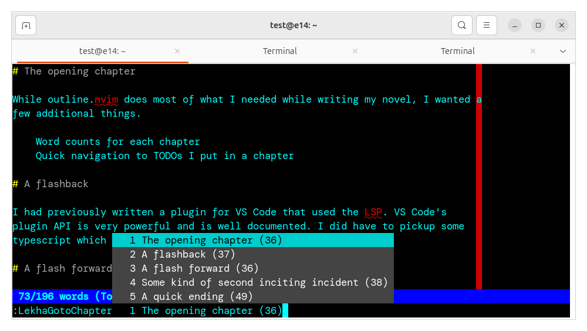

# Lekha.nvim



`Lekha` is a minimalistic (in appearance and function) NeoVim plugin for novel
writing:

- It uses NeoVim's auto complete feature to display the chapters and word counts
  when the "jump to chapter" command is called. There is no split pane. This
  reduces visual clutter but keeps the information accessible.
- Only looks at top level headings (Lines that start with `# `)
- [Planned]: TODO and Bookmarks lists


# Installation

`git clone` the repository (or just copy the `lua` folder) to somewhere in your
runtime path. Then add something like this to your `markdown.vim`:

```
-- Register Lekha commands
lua require("lekha").enable()
-- Register a convenient shortcut key 
nmap <Tab> :LekhaGotoChapter<Space>
```

Now by hitting Tab twice in normal mode you can access the go to chapter command
and see and navigate through a list of chapters.

## Use in statusline

Add `%` to the status line to print 
the chapter the cursor is in.


# Notes

1. I had little trouble writing this NeoVim plugin in Lua though I had never
   written a NeoVim plugin before and didn't know Lua. The NeoVim documentation
   is adequate though I had to supplement with web searches
   for a few things.
1. Vim/NeoVim's editing efficiency and Lua's speed impresses me. I have a 140,000 word manuscript
   and the dumb algorithm I implemented here doesn't take any perceptible time
   to run.

## Lua/NeoVim API Concepts
1. Ordered arrays
1. Calling NeoVim commands from Lua
1. Creating autocommands and commands

# References

1. [outline.nvim](https://github.com/hedyhli/outline.nvim) is both way more
powerful and not powerful enough for my writing needs. It has a split-pane
outline view, but not per-chapter word count and no TODO/bookmark feature. 
1. [minimal-bookmarks.nvim](https://github.com/yuriescl/minimal-bookmarks.nvim)
1. [section-wordcount.nvim](https://github.com/dimfeld/section-wordcount.nvim)
